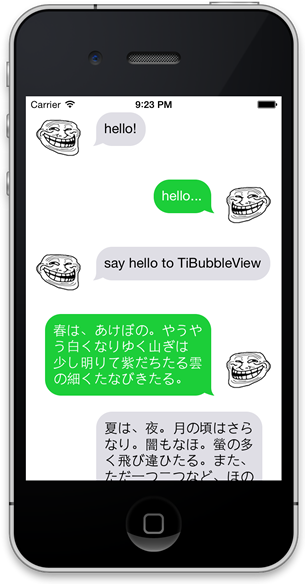

# TiBubbleView

Inspired by [BubbleDraw](https://github.com/miyakeryo/objc-ryo/tree/master/BubbleDraw/BubbleDraw). for Titanium app.



## Install

[Compiled module download](be.k0suke.tibubble-iphone-0.1.zip)

## Usage

You can see screenshot's example at [example/app.js](example/app.js).

```javascript
var label = Ti.UI.createLabel({
	top: 10,
	right: 10, // or 14 (consider the bubble beak)
	bottom: 10,
	left: 14, // or 10 (consider the bubble beak)
	width: Ti.UI.SIZE,
	height: Ti.UI.SIZE,
	color: '#fff',
	textAlign: Ti.UI.TEXT_ALIGNMENT_LEFT,
	verticalAlign: Ti.UI.TEXT_VERTICAL_ALIGNMENT_TOP,
	text: 'hello, world'
});

var TiBubble = require('be.k0suke.tibubble');
var bubble = TiBubble.createView({
	top: 0,
	left: 10,
	width: Ti.UI.SIZE, // just fit from contained label
	height: Ti.UI.SIZE, // just fit from contained label
	bubbleColor: '#dfdee5', // default: #fff
	bubbleRadius: 20, // default: 20
	bubbleBeak: TiBubble.BUBBLE_BEAK_LEFT // default BUBBLE_BEAK_LEFT
	bubbleBeakVertical: TiBubble.BUBBLE_BEAK_UPPER // default BUBBLE_BEAK_LOWER
});
bubble.add(label);
```

### Properties

* bubbleColor
* bubbleRadius
* bubbleBeak / BUBBLE_BEAK_LEFT or BUBBLE_BEAK_RIGHT
* bubbleBeakVertical / BUBBLE_BEAK_LOWER or BUBBLE_BEAK_UPPER

## License

The MIT License (MIT) Copyright (c) 2014 Kosuke Isobe
